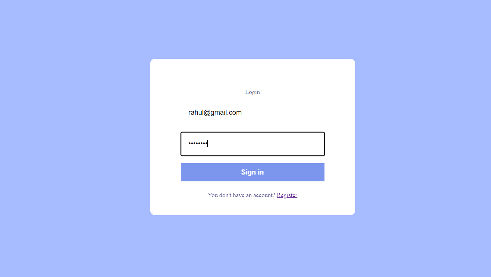

# Chatting App

Welcome to the Chatting App! This application provides a real-time chat experience, allowing users to exchange messages and images one-on-one within the application.

## Features

- **Real-Time Chat:** Implemented real-time chat functionality for seamless communication.
- **Image Sharing:** Users can exchange images along with text messages.
- **Firebase Backend:** The back-end and database are designed and executed using Firebase, ensuring optimized application performance.

## Technologies Used

- Firebase: Backend and database management.
- Git and GitHub: Efficient codebase management, ensuring streamlined project organization.
- Cross-Browser Compatibility: The app is designed to provide a consistent user experience across major web browsers such as Chrome, Firefox, Safari, etc.

## Getting Started

To get started with the Chatting App, follow these steps:

1. Clone the repository: `git clone https://github.com/amrahul14/chatting-app.git`
2. Install dependencies: `npm install` (or `yarn install`)
3. Start the application: `npm start` (or `yarn start`)

## Screenshots

### Login Page

### Register Page

### Home Page

## Usage

1. Open the app in your preferred web browser.
2. Sign in or create an account.
3. Start chatting with your friends in real-time!

## Contributing

We welcome contributions! If you'd like to contribute to the project, please follow these steps:

1. Fork the repository.
2. Create a new branch: `git checkout -b feature/new-feature`
3. Make your changes and commit them: `git commit -m 'Add new feature'`
4. Push to the branch: `git push origin feature/new-feature`
5. Submit a pull request.

## Contact

If you have any questions or issues, feel free to reach out to us at [rahul15kumar9708@gmail.com](mailto:rahul15kumar9708@gmail.com).

Happy chatting!
